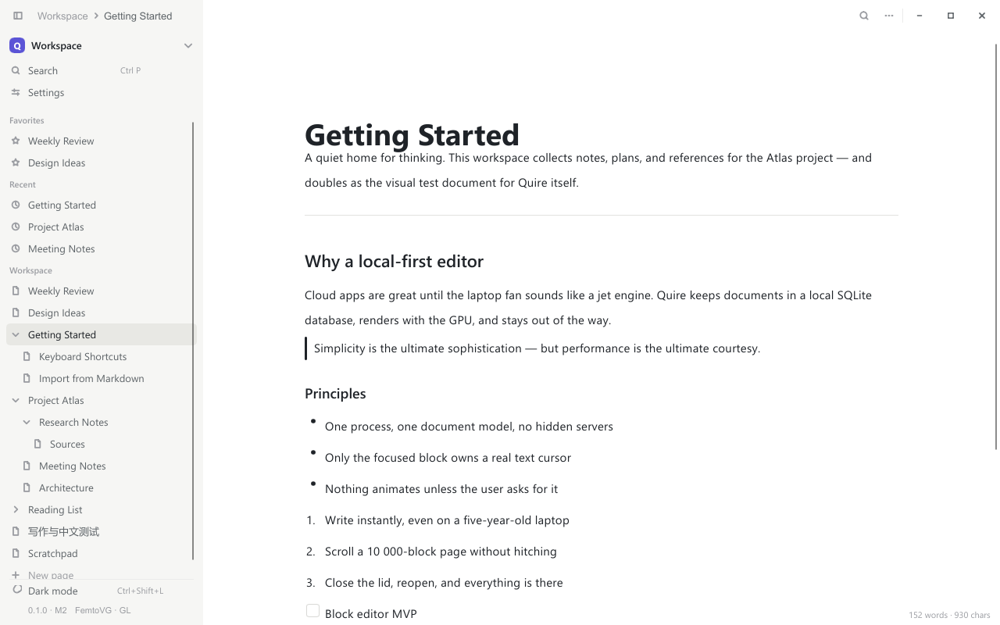
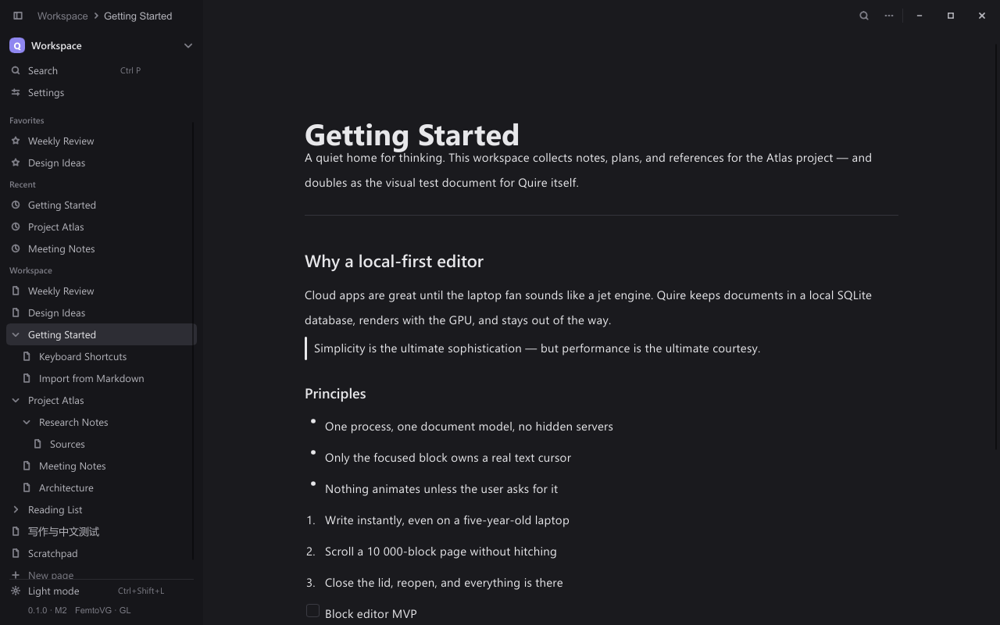
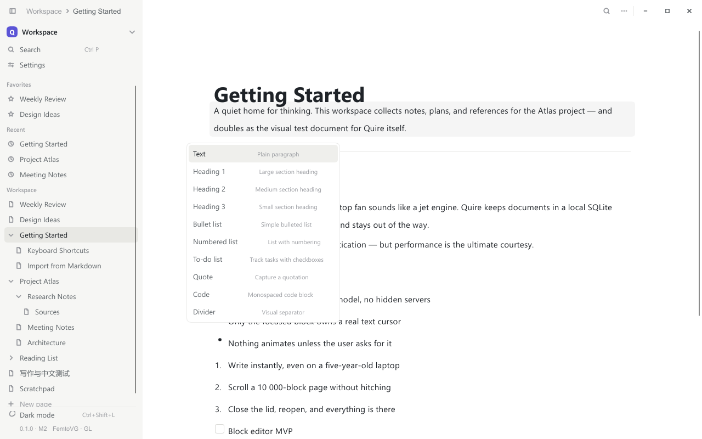
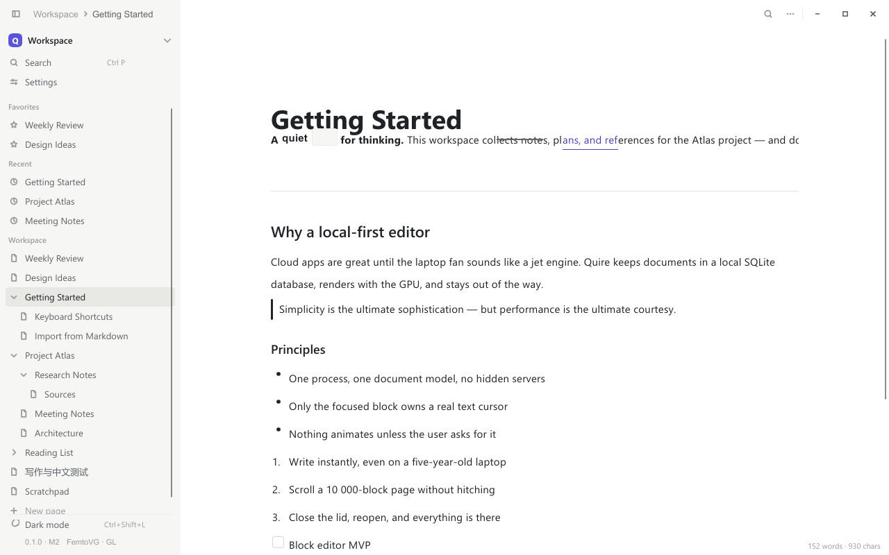

# Quire

A local, GPU-accelerated, Notion-like document workspace.
Rust + Slint. Single process. No Electron, no WebView, no web stack.



| | |
|---|---|
|  |  |
|  |  |

More shots in [docs/screenshots](docs/screenshots).

```
just build                    # cargo build --release (default FemtoVG renderer)
just run                      # cargo run (debug)
just check                    # local CI replacement: check + test + release
just shot menu                # headless visual shot (scene name optional)
just clean                    # cargo clean + remove skia/wgpu benchmark target dirs
```

Plain cargo still works as before:

```
cargo run                     # debug, FemtoVG renderer
cargo run --release           # release
cargo run --no-default-features --features skia --release   # Skia build
```

- Full requirements (original spec, zh-CN): `docs/SPEC.md`
- Status & roadmap: `PLAN.md`
- Why it looks like this: `docs/ARCHITECTURE.md`, `docs/DECISIONS.md`
- Measured numbers: `docs/PERFORMANCE.md` (`benchmarks/scripts/bench.ps1`)

## 核心目标（浓缩版）

现代、轻量、GPU 加速的本地 Notion-like 文档应用。第一平台 Windows，之后 Android。
优先级：UI 视觉质量 > 编辑体验 > 低 RAM > 低 CPU > GPU 渲染 > 可维护性 > 功能数量。

**技术底座**：Rust + Slint 1.18.x（MSVC），单进程；UI 层（`.slint`：视觉/布局/交互）与
Rust Core（文档模型、Undo/Redo、SQLite 持久化、搜索、命令分发）严格分离。
UI 不直接碰数据库或磁盘 IO。Renderer 需实测对比 FemtoVG·wgpu 与 Skia。

**架构原则**：
- Block Tree 文档模型（稳定 ID + order），不用巨型字符串存页面
- 所有编辑操作走 Command 系统，Undo/Redo 基于内存模型而非数据库
- Block 渲染虚拟化：只有焦点 Block 使用真正的 TextEdit，非可见块不占昂贵 UI 资源
- 自动保存：dirty → debounce → 批量写 SQLite（事务），杜绝每字符写库
- 中文输入依赖 Slint 文本设施 + 系统 IME，禁止自研 TSF/IME
- 动画“有反馈但不持续运行”，静止界面 CPU 应接近 0

**明确不做（第一版）**：云同步、协作、AI、插件市场、Electron/WebView/任何 Web 栈。

## 功能亮点（v0.1 RC）

- **块编辑器**：段落、三级标题、列表（含待办勾选）、引用、代码块、分割线、
  Callout 标注块；Enter/Backspace 合并拆分、Tab 列表嵌套、Ctrl+D 复制块
- **Notion 式交互**：`/` 斜杠菜单；`# ` `- ` `1. ` `[] ` `> ` `---` ` ``` ` 等
  Markdown 行内快捷方式；块手柄（＋/⋮⋮）拖拽排序，橙色落点线提示
- **⋮⋮ 块菜单**：Turn into / Duplicate / Copy link to block（复制
  `quire://block/<id>` 锚点到剪贴板）/ Move to（整棵子树跨页移动，单步撤销）/
  Text & Background color（10 色色板，亮暗两套）/ Delete
- **链接**：Ctrl+L 为选中文字加链接；`quire://block/…`、`quire://page/…`
  内部锚点点击即在应用内跳转，外部 URL 交给系统浏览器
- **富文本**：粗体 Ctrl+B、斜体 Ctrl+I、删除线 Ctrl+Shift+X、行内代码 Ctrl+E
- **工作区**：页面树 / 收藏 / 最近 / 全文搜索（FTS5 + 中文分词）/
  命令面板 Ctrl+K / 页内查找 Ctrl+F
- **可靠存储**：SQLite 单文件库、防抖批量写入（Ctrl+S 立即落盘）、
  滚动快照备份 + 损坏自恢复、滚动日志与崩溃报告
- **桌面集成**：亮/暗主题、无边框自绘窗口、Markdown 导入导出、Inno Setup 安装包

## Milestones

| | 内容 | 状态 |
|--|------|------|
| M0 | 工具链、GPU renderer 验证、benchmark 基线 | ✅ |
| M1 | 设计系统（Theme/Colors/Typography/Icons）+ 产品级 App Shell | ✅ |
| M2 | App Shell：Sidebar / Page Tree / 编辑区 / 搜索 / 设置 | ✅ |
| M3 | 本地文档：SQLite、自动保存、重启恢复 | ✅ |
| M4 | Block Editor MVP（Enter/Backspace/合并/拆分/Undo…） | ✅ 核心完成，IME 验收待用户 |
| M5 | Notion 交互：Slash 菜单、Markdown 快捷方式、块拖拽、⋮⋮ 菜单（含 Copy link / Move to / 块颜色） | ✅ |
| M6 | 富文本 inline marks（bold/italic/code/link…） | ✅（含导入导出与链接 UI；行内折行渲染有平台限制） |
| M7 | 性能：虚拟化、后台搜索、基准矩阵（1000/10000 blocks 实测） | ✅ 矩阵实测完成（femtovg/skia 对比） |
| M8 | Windows RC：crash recovery、打包、导入导出、性能审计 | ✅ 主体完成（日志/轮换快照/数据迁移/安装器/LAN 分享/release profile 审计已落地；页面可移动、Page/Link 块、富粘贴、设置存储行已进；IME 人工验收 + 视觉 sweep 待完成） |
| M9 | Android（共享核心模型，UI 重新设计） | 待办 |

First release (Windows): block editor (with callouts, block colors, page
& link-to-page blocks, cross-page moves), rich paste of markdown into
blocks, a movable page tree, local SQLite storage with rotating backups,
command palette, Chinese input via the OS IME — nothing cloud, nothing
sync, yet.
